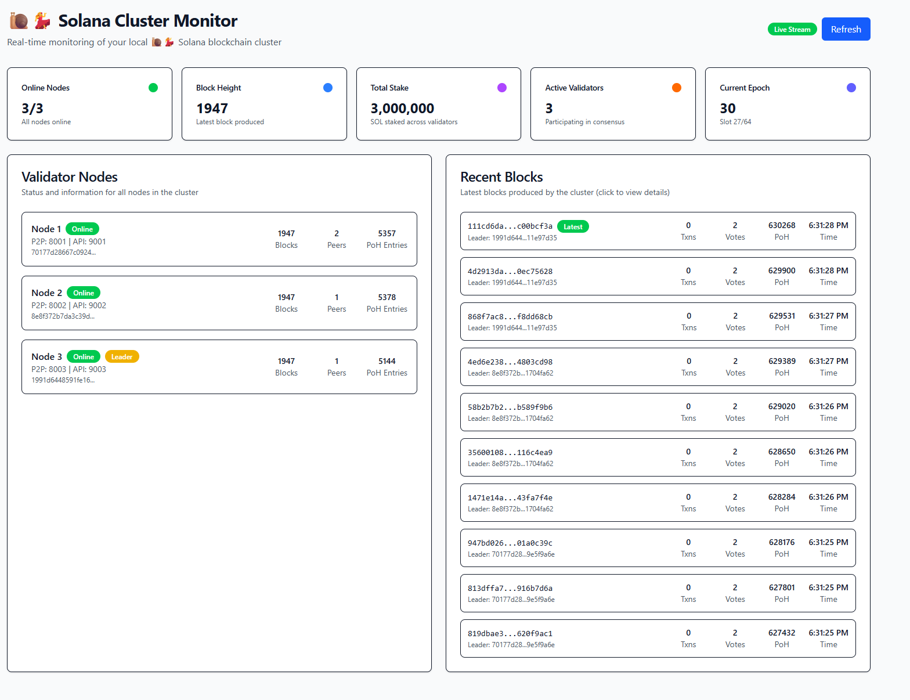

# Solana Node.js Implementation 🐌💃



⚠️ **Disclaimer**: This is a **very minimal, theoretical implementation** of the Solana blockchain built with Node.js and TypeScript. This project should be taken with a grain of salt - it was almost purely vibecoded based on general blockchain knowledge and understanding of Solana concepts, rather than following official specifications or production-grade implementations.

## Features

-   **Proof of History (PoH)**: Cryptographic clock using SHA-256 hash chains for verifiable time ordering
-   **Simplified Tower BFT**: Consensus mechanism based on stake-weighted voting with lockouts
-   **Leader Schedule**: 4-slot rotation system ensuring fair validator participation
-   **P2P Networking**: WebSocket-based communication between nodes with gossip protocol
-   **Transaction Processing**: Basic account-based transaction system with replay protection
-   **Block Production**: Leader-based block creation and validation with PoH integration
-   **Multi-Node Cluster**: Support for 3-node local development cluster
-   **Real-time Web Dashboard**: React-based monitoring interface with live updates
-   **HTTP APIs**: RESTful endpoints for blockchain data and node status
-   **Ed25519 Cryptography**: Secure digital signatures using the @noble/ed25519 library

## Quick Start

### Prerequisites

-   Node.js >= 18.0.0
-   npm or yarn

### Installation

```bash
# Clone the repository
git clone <repository-url>
cd solana-nodejs

# Install dependencies for the main project
npm install

# Install dependencies for the web UI
cd web-ui
npm install
cd ..

# Build the project
npm run build
```

### Complete Setup (Recommended)

For the full experience with cluster monitoring:

```bash
# Terminal 1: Start the 3-node cluster
npm run cluster:start

# Terminal 2: Start the web dashboard
npm run web:dev
```

Then open `http://localhost:5173` in your browser to monitor the cluster in real-time.

### Alternative: Single Node

```bash
# Development mode
npm run dev

# Production mode
npm start
```

### Individual Node Management

```bash
# Start nodes individually (useful for debugging)
npm run cluster:node1  # Node 1: P2P port 8001, API port 9001
npm run cluster:node2  # Node 2: P2P port 8002, API port 9002
npm run cluster:node3  # Node 3: P2P port 8003, API port 9003
```

### Web Dashboard

Monitor your cluster in real-time with the React-based web dashboard:

```bash
# Start the web UI (in a separate terminal)
npm run web:dev
```

Then open `http://localhost:5173` to view:

#### Dashboard Features

-   **Cluster Overview**: Real-time monitoring of online nodes, block height, total stake, and active validators
-   **Node Status**: Detailed information about each validator node including:
    -   Node ID, address, and port
    -   Stake amount and validator status
    -   Current leader information
    -   Network connectivity status
-   **Block Explorer**: Browse recent blocks with:
    -   Block hash, height, and timestamp
    -   Transaction counts and PoH data
    -   Leader information for each block
    -   Detailed block modal with full transaction data
-   **Real-time Updates**: Automatically refreshes every 2 seconds using WebSocket connections
-   **Responsive Design**: Built with Tailwind CSS v4 and shadcn/ui components

#### API Endpoints

Each validator node exposes HTTP APIs:

-   **Node 1**: `http://localhost:9001/api/*`
-   **Node 2**: `http://localhost:9002/api/*`
-   **Node 3**: `http://localhost:9003/api/*`

Available endpoints:

-   `/api/status` - Node status and basic info
-   `/api/blockchain` - Full blockchain data
-   `/api/blocks?limit=10` - Recent blocks
-   `/api/consensus` - Consensus state and leader schedule
-   `/api/network` - Network status and peer information
-   `/api/poh` - Proof of History data
-   `/api/epoch` - Current epoch information
-   `/api/epoch/:epochNumber` - Leader schedule for specific epoch

## Project Structure

```
src/
├── __tests__/         # Test files
│   ├── crypto.test.ts
│   ├── leader-schedule.test.ts
│   ├── poh.test.ts
│   └── transaction.test.ts
├── core/              # Core blockchain components
│   ├── block/        # Block structure and validation
│   ├── consensus/    # Consensus mechanism (Tower BFT-inspired)
│   ├── poh/          # Proof of History implementation
│   ├── transaction/  # Transaction processing
│   └── index.ts      # Core exports
├── crypto/           # Cryptographic utilities
│   ├── keys/         # Key generation and management
│   ├── signatures/   # Digital signatures (Ed25519)
│   └── index.ts      # Crypto exports
├── network/          # Networking layer
│   ├── p2p/          # Peer-to-peer WebSocket networking
│   └── index.ts      # Network exports
├── node/             # Node implementations
│   ├── validator/    # Validator node implementation
│   └── index.ts      # Node exports
├── types/            # TypeScript type definitions
│   └── index.ts      # Shared types and interfaces
└── index.ts          # Main entry point

web-ui/               # React-based monitoring dashboard
├── src/
│   ├── components/   # React components
│   │   ├── ui/       # shadcn/ui components
│   │   ├── BlockDetailsModal.tsx
│   │   ├── BlocksList.tsx
│   │   ├── ClusterOverview.tsx
│   │   └── NodesList.tsx
│   ├── hooks/        # Custom React hooks
│   ├── lib/          # Utility functions
│   ├── types/        # Frontend type definitions
│   └── App.tsx       # Main React app
├── package.json      # Frontend dependencies
└── vite.config.ts    # Vite configuration
```

## Development

### Scripts

#### Main Project

-   `npm run build` - Build the TypeScript project
-   `npm run dev` - Run single node in development mode
-   `npm run start` - Run single node in production mode
-   `npm test` - Run tests
-   `npm run test:watch` - Run tests in watch mode
-   `npm run test:coverage` - Run tests with coverage report
-   `npm run lint` - Run ESLint
-   `npm run lint:fix` - Fix ESLint issues
-   `npm run clean` - Remove build artifacts

#### Cluster Management

-   `npm run cluster:start` - Start all 3 nodes simultaneously
-   `npm run cluster:node1` - Start node 1 (port 8001, API port 9001)
-   `npm run cluster:node2` - Start node 2 (port 8002, API port 9002)
-   `npm run cluster:node3` - Start node 3 (port 8003, API port 9003)

#### Web UI

-   `npm run web:dev` - Start the React development server
-   `npm run web:build` - Build the web UI for production
-   `npm run web:preview` - Preview the built web UI

### Testing

```bash
# Run all tests
npm test

# Run tests with coverage
npm run test:coverage

# Run tests in watch mode
npm run test:watch
```

## Architecture

This implementation focuses on the core concepts of Solana:

1. **Proof of History**: Creates a verifiable delay function using SHA-256 hash chains for time ordering
2. **Consensus**: Simplified Tower BFT with stake-weighted voting and exponential lockouts
3. **Leader Schedule**: 4-slot rotation system where each validator gets consecutive slots per rotation
4. **Networking**: WebSocket-based P2P communication with gossip protocol for block and transaction propagation
5. **Transactions**: Basic account-based transfers with nonce-based replay protection
6. **Blocks**: Leader-produced blocks with PoH integration and epoch-based transitions
7. **Web Interface**: Real-time React dashboard for cluster monitoring and block exploration

### Key Components

-   **SimplifiedConsensus**: Handles voting, leader selection, and epoch transitions
-   **ProofOfHistory**: Generates verifiable time-ordered hash sequences
-   **ValidatorNode**: Main node implementation with P2P networking and HTTP APIs
-   **Block & Transaction**: Core data structures with cryptographic validation
-   **Web Dashboard**: Real-time monitoring interface built with React and Tailwind CSS

For detailed architecture information, see [ARCHITECTURE.md](./ARCHITECTURE.md).

## Technology Stack

### Backend

-   **Runtime**: Node.js >= 18.0.0
-   **Language**: TypeScript
-   **Cryptography**: @noble/ed25519, @noble/hashes
-   **Networking**: WebSocket (ws library)
-   **HTTP Server**: Express.js with CORS
-   **Testing**: Jest with ts-jest

### Frontend (Web Dashboard)

-   **Framework**: React 19 with TypeScript
-   **Build Tool**: Vite 7
-   **Styling**: Tailwind CSS v4 with @tailwindcss/vite plugin
-   **Components**: shadcn/ui (adapted for Tailwind v4)
-   **Icons**: Lucide React
-   **State Management**: React hooks with custom data fetching

### Development Tools

-   **Linting**: ESLint with TypeScript support
-   **Type Checking**: TypeScript compiler
-   **Package Management**: npm
-   **Hot Reload**: Vite dev server for frontend, ts-node for backend

## Implementation Roadmap

See [ROADMAP.md](./ROADMAP.md) for detailed development phases and milestones.

## Limitations & Important Notes

This is a **highly simplified, educational implementation** with significant limitations:

### Technical Limitations

-   In-memory storage only (no persistence)
-   Basic transaction types (transfers only)
-   Simplified consensus (not full Tower BFT)
-   No smart contract support
-   No sharding
-   Basic networking (WebSocket instead of UDP)
-   No runtime environment or virtual machine
-   Simplified cryptography (not production-grade)
-   No transaction fees or economic incentives
-   No slashing or validator penalties
-   Limited to 3-node clusters

### Development Approach

This project was developed through "vibecooding" - implementing features based on:

-   General understanding of blockchain concepts
-   High-level knowledge of Solana's architecture
-   Intuitive interpretation of how systems might work
-   **NOT** rigorous study of official Solana specifications

### Use Cases

✅ **Good for:**

-   Learning blockchain concepts
-   Understanding Solana's high-level architecture
-   Experimenting with consensus mechanisms
-   Educational demonstrations

❌ **NOT suitable for:**

-   Production use
-   Reference implementation
-   Security-critical applications
-   Performance benchmarking against real Solana

## Contributing

1. Fork the repository
2. Create a feature branch
3. Make your changes
4. Add tests for new functionality
5. Ensure all tests pass
6. Submit a pull request

## License

MIT License - see [LICENSE](./LICENSE) file for details.

## Resources

-   [Solana Whitepaper](https://solana.com/solana-whitepaper.pdf)
-   [Solana Documentation](https://docs.solana.com/)
-   [Tower BFT Paper](https://medium.com/solana-labs/tower-bft-solanas-high-performance-consensus-algorithm-e9c2b8b8c87c)
